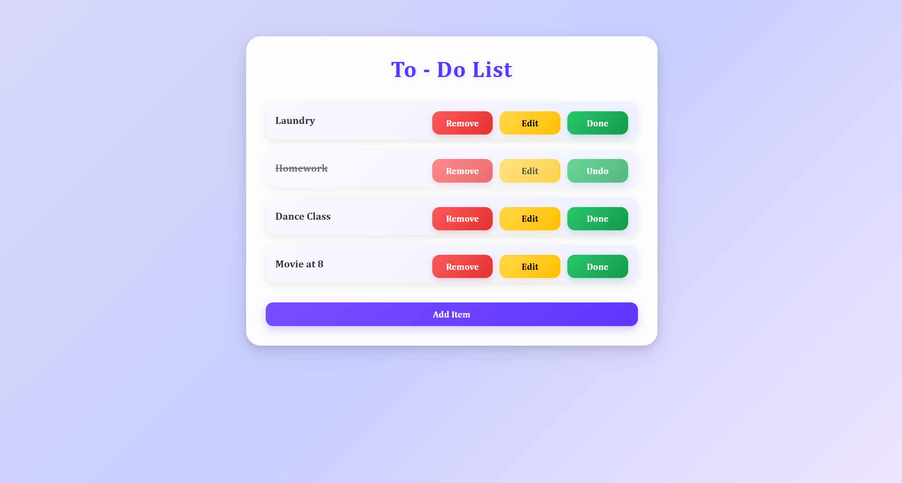

# 📝 To-Do List App

A simple and interactive To-Do List application built using HTML, CSS, and JavaScript.

The application allows users to create, update, delete, and mark tasks as completed through a clean and responsive user interface.

---

## 🚀 Features

- ➕ Add new tasks
- ✏️ Edit existing tasks
- ❌ Delete tasks
- ✅ Mark tasks as completed
- 🔄 Dynamic DOM manipulation
- ⚡ Async JavaScript implementation
- 🎨 Clean and responsive user interface
- 🧩 CRUD functionality

---

## 🛠️ Technologies Used

- HTML5
- CSS3
- JavaScript (ES6+)
- Async/Await

---

## 📸 Screenshot



---

## 📂 Project Structure

```text
ToDo-List/
│
├── index.html
├── screenshots/
│   └── todo-app.png
└── README.md
```

---

## 🎯 Learning Outcomes

Through this project, I practiced:

- DOM Manipulation
- Event Handling
- CRUD Operations
- JavaScript Functions
- Async/Await
- User Interface Design
- Problem Solving

---

## ⚠️ Current Limitations

- No Local Storage integration
- No Database support
- Tasks are cleared after page refresh
- No user authentication

---

## 🔮 Future Enhancements

Planned improvements for future versions:

- 💾 Save tasks using Local Storage
- 🗄️ Backend database integration
- 📅 Due dates and reminders
- 🔍 Task search and filtering
- 📱 Enhanced mobile responsiveness
- 🌙 Dark Mode support
- 📊 Task statistics dashboard
- ☁️ Cloud synchronization

---

## 👨‍💻 Author

Developed by **Preety Makkar**
